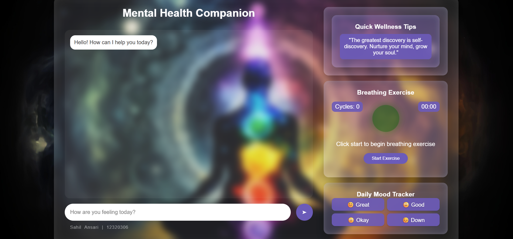

# 🧠 Mood-Based Mental Health Companion 🌿

A web-based chatbot and daily mood tracker that provides poetic, funny, and supportive responses based on the user's emotional state. Built with **Flask**, **HTML/CSS/JS**, and integrates **Google Gemini AI** for mental health–focused conversations.

---

### 📸 Screenshot




---

### 🚀 Features

- 🎭 Mood Tracker with poetic & funny responses for:
  - Great 😊
  - Good 🙂
  - Okay 😐
  - Down 😔
- 🤖 Chatbot powered by Google Gemini AI, trained to respond to **mental health–related** queries.
- 🌬️ Built-in **breathing exercise** animation with timer and cycle counter.
- 🧘 Daily wellness tips fetched using AI every minute.
- ✨ Polished, glassmorphic UI with interactive messages.

---

### 🧰 Tech Stack

- **Backend**: Flask (REST API)
- **Frontend**: HTML + CSS + JavaScript (Vanilla)
- **AI Integration**: Google Generative AI (Gemini)
- **Deployment**: Render
- **Other**: Gunicorn, Python-Dotenv, Flask-CORS

---

### 📁 Project Structure

```
.
├── app.py               # Flask application
├── templates/
│   └── index.html       # Frontend UI
├── requirements.txt     # Python dependencies
├── render.yaml          # Render deployment configuration
└── .env                 # API key (not committed)
```

---

### ⚙️ Setup Instructions

#### 🔧 Local Setup

1. **Clone the repository**
   ```bash
   git clone https://github.com/your-username/mood-tracker-bot.git
   cd mood-tracker-bot
   ```

2. **Create `.env` file**
   ```env
   GOOGLE_API_KEY=your_google_generative_ai_key
   DEBUG=True
   ```

3. **Install dependencies**
   ```bash
   pip install -r requirements.txt
   ```

4. **Run the app**
   ```bash
   python app.py
   ```

5. Visit [http://127.0.0.1:5000](http://127.0.0.1:5000)

---

#### ☁️ Deploy on Render

1. Connect your GitHub repo to [Render](https://render.com/)
2. Use `render.yaml` for automatic setup
3. Add `GOOGLE_API_KEY` as an environment variable
4. Render will run:
   - Build: `pip install -r requirements.txt`
   - Start: `gunicorn app:app`

---

### 💬 Mood Introduction Line

> **"Brace yourself... your vibe has summoned a poetic prophecy!"**

This playful, poetic line appears when a user selects any mood — making responses feel magical and personalized.

---

### 👤 Author

Made with 💚 by **Sahil Ansari**  
🔗 GitHub: [github.com/your-username](https://github.com/your-username) *(replace with your actual GitHub link)*

---
